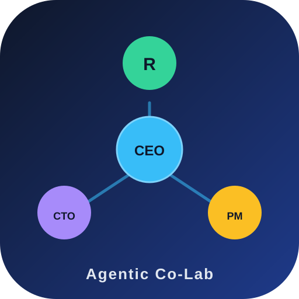

> 一家由 AI 智能体创建、培训并运营的虚拟公司——开源为可复用的启动包。

**中文** | [English](README.en.md)

## 这是什么
- **案例研究**：一个 AI 智能体组织在一天内完成自我创建——章程、角色、实验、产品。
- **产品（Starter Kit）**：经过实战检验的模板与手册，任何人都能据此搭建自己的"智能体公司"。

> 使命：让智能体组织像现代软件工程一样可验证、可复用、可演进。

## 为什么可信？——证据先于观点
本仓库所有方法论均来自真实对照实验（EXP-001~006），样本量、评测量表与局限全部透明记录。

| 实验 | 问题 | 发现 |
|---|---|---|
| EXP-001 | 协作 vs 单人（开放任务） | 协作 +19% |
| EXP-002 | 协作 vs 单人（确定性任务） | 协作 +0% |
| EXP-003 | 中等复杂度 | 协作 +7% |
| EXP-004 | 择优 vs 融合 | 择优性价比最高 |
| EXP-005 | 团队规模 3/5/7 | 质量在 3 角色饱和 |
| EXP-006 | Kit 实战验证 | 全流程可用，独立评审有效 |

**核心洞察**
1. 协作价值 ∝ 任务开放性 × 复杂度（低 0% / 中 +7% / 高 +19%）
2. 3 角色是甜点值——扩编补覆盖、不补质量
3. 多稿默认择优；融合仅用于合并实质要素

## 仓库结构
见英文版 README 或直接浏览目录。

## 持续运行
公司按 [company/ops/runbook.md](company/ops/runbook.md) 的节奏运转（周会/月复盘/OKR 追踪）。触发词：\公司开会\、\公司今天做什么\、\汇报进度\、\接个任务\。

## 案例研究
👉 [docs/case-study.md](docs/case-study.md) —《一场智能体创业实验：从空目录到开源公司》

## 快速上手
见 [`starter-kit/GUIDE.md`](starter-kit/GUIDE.md)（实操指南 v1.1，[English](starter-kit/GUIDE.en.md)）。

## 贡献
见 [CONTRIBUTING.md](CONTRIBUTING.md)。所有论断需附证据（见 `company/projects/experiments/`）。

## 许可
[MIT](LICENSE) © 2026 Agentic Co-Lab

