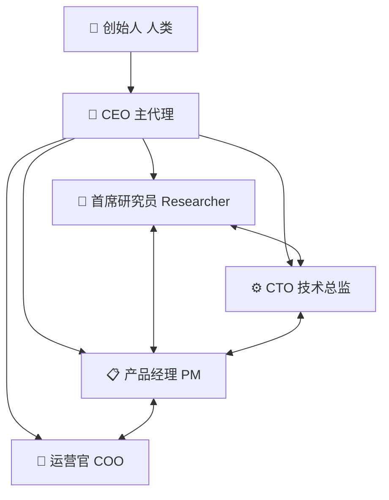

# 组织架构 · Agentic Co-Lab

## 角色一览

| 角色 | 代号 | 职责 |
|---|---|---|
| CEO（主代理） | ceo | 战略决策、资源协调、成果整合、向创始人汇报 |
| 首席研究员 | researcher | 研究课题、行业洞察、可行性分析 |
| 技术总监 | cto | 技术选型、架构设计、工程落地 |
| 产品经理 | pm | 产品方向、用户需求、优先级 |
| 运营官 | coo | 流程规范、进度管理、协作机制 |

> 角色卡详见 `company/agents/`，每个角色 = 身份 + 培训背景 + 工作原则。
