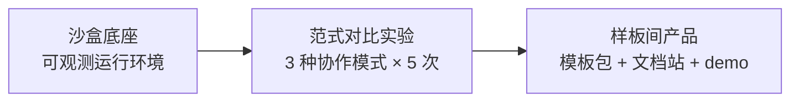

# 项目立项书 · Co-Lab 实验台（第一阶段）

- **项目代号**：co-lab-experiment
- **立项日期**：2026-08-10
- **状态**：✅ 已批准（CEO 决策 2026-08-10，创始人授权）
- **负责人**：Gauss（研究）、Avicenna（工程）、Bohr（产品）

## 一句话
用可复现实验验证"多智能体组织如何协作才高效"，并把验证过的方法论固化为可对外复用的样板产品。

## 目标
1. 产出第一份可信的协作范式对比报告（质量 / token 成本 / 耗时）
2. 沉淀统一评测框架与 2 个标准化基准任务
3. 为第二阶段"样板间产品化"提供证据与模板基础

## 三阶段路线

| 阶段 | 内容 | 预估周期 |
|---|---|---|
| 底座 | LangGraph + FastAPI + 追踪基建 + Docker 一键启动 | 1 周 |
| 实验 | 3 种协作模式（线性 / 图编排 / 市场竞价）× 5 次重复，量化对比 | 1-2 周 |
| 产品 | 胜出模式固化为 Starter Kit 模板 + 样板项目 + 文档站 | 2 周 |

## 技术栈（MVP）
- 编排：LangGraph（状态图驱动）
- 运行时：Python + FastAPI
- 存储：SQLite + 向量库（Chroma 起步）
- 可观测：结构化日志 + LangSmith 追踪
- 交付：Docker Compose

## 成功标准
- [ ] 完成 ≥30 次实验运行，输出含置信区间的对比报告
- [ ] 外部团队仅凭模板即可复现协作流程
- [ ] 一次公开协作实验可作 MVP demo

## 主要风险
| 风险 | 缓解 |
|---|---|
| 自我参照偏差 | 固定任务集、统一评测、多次重复 |
| 编排开销抵消协作收益 | 把"无显著差异"也视为有效结论 |
| token 成本波动 | 缓存 + 本地模型（Ollama）对冲 |
| 方法论过拟合 | 模板脱离本公司场景做验证 |

