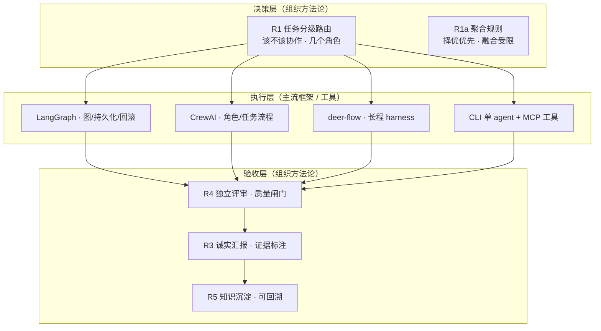

# Agentic Co-Lab 组织方法论 vs 主流多智能体框架：对比分析

> **任务 TK-014 · Agentic Co-Lab 研究院 · 2026-08-11 · 版本 v1.0**
> **授权链**：CEO → 研究院负责人（R7 两级授权链）· 负责人亲自执行（规模例外，保留拆解-验收-汇报闭环）
> **输入**：TK-013 生态调研报告（2026-08-11 数据时点）｜运营手册 v0.2（R1~R7）｜协作价值矩阵 v5（EXP-001~009）｜《如何验证智能体协作效果》v1.0
> **定位**：TK-013 第 4 条洞察（多智能体胜者是「可控」）的延伸分析；不采集新外部数据，仅对既有证据做对比推演，推演处已显式标注。

---

## 执行摘要

1. **两条「可控」路线，管的是不同层**：主流框架（LangGraph/CrewAI/deer-flow）实现**执行层可控**——状态、流程、可恢复、可观测、人机协同；Agentic Co-Lab 方法论实现**组织层可控**——该不该多智能体、几个角色、产出怎么聚合、质量谁来验收、证据如何留痕。二者不是二选一，而是决策层/执行层/验收层的分工。
2. **框架的「可控」是机制，方法论的「可控」是纪律**：框架把 agent 怎么跑变成显式图/角色/长程 harness；方法论把「协作值不值得」变成可证伪的对照问题（协作价值 ∝ 任务开放性 × 复杂度）。
3. **主流框架有六个共性盲区，均可用我们的实证证据补上**：①不回答「该不该协作」（EXP-002/008/009 协作 +0% vs EXP-001 +19%）；②不设角色数预算（EXP-005 3 角色饱和）；③默认聚合即融合（R1a 择优 > 融合）；④无内置质量闸门（EXP-007 R4 独立评审 +9%）；⑤无证据纪律（R2/R3/R5）；⑥无成本-价值意识（4 倍成本换 +0% 的实测）。
4. **反向看，框架补我们五个短板**：生产级状态/持久化/回滚（LangGraph）、长程断点续跑（deer-flow）、可视化可观测（AgentScope）、跨厂商互操作（MCP/A2A）、跨会话记忆（mem0/claude-mem）。我们当前是文档落盘 + 人工可追溯，未系统化。
5. **选型建议一句话**：**用 R1 路由做决策、用框架做执行、用 R1a/R4/R3 做聚合与验收**——认知型单次产出走方法论（成本敏感），生产级/长程/部署型走框架（能力补齐），组合模式为「方法论 → 框架 → 方法论」三层。
6. **诚实边界**：结论建立在 n=1~3 探索性实验 + 单时点生态快照上；「方法论 × 框架」的组合建议是**推演**，我们尚未在生产规模下实测组合效果，不可外推为普适结论。

---

## 一、TK-013 的关键前提：胜者是「可控」

TK-013（2026-08-11T10:22:39Z，60 项目快照）多智能体编排部分的实测信号：

| 项目 | Stars | 心智模型 | 活跃信号（2026-08） | 定位判断 |
|---|---:|---|---|---|
| crewAIInc/crewAI | 56,931 | 角色/任务流程 | 7d +328，Pulse 77.7，2 天前发版 | 角色化编排，动量高 |
| bytedance/deer-flow | 79,727 | 长程 SuperAgent harness | 2025-05 创建，活跃 | 新星：长程研究/编码/创作 |
| langchain-ai/langgraph | 39,440 | 图式状态编排（持久化/回滚/人机协同） | 7d +589，Pulse 75.3，生产标杆 | 生产级图编排 |
| microsoft/autogen | 60,356 | 多 agent 对话 | 118 天未推送，10 个月未发版，4 周 0 提交 | 维护模式，官方推荐迁至 Agent Framework/AG2 |
| FoundationAgents/MetaGPT | 69,770 | 「AI 软件公司」流水线 | 202 天未推送 | 理念先驱，工程停滞 |
| openai/swarm | 21,893 | 教学/实验 | 118 天未推送 | 基本停滞 |
| microsoft/agent-framework（5.1 表） | 12,727 | AutoGen 官方继任 | — | 厂商官方路线 |
| ag2ai/ag2 | 4,851 | AutoGen 社区分支 | 13 天前发版 | 小众续命 |
| agentscope-ai/agentscope | 28,817 | 可视化可观测多 agent | 活跃，MCP 支持 | 可观测性卖点 |

TK-013 洞察 4 的原文结论是：**「多」不是卖点，「可恢复、可观测、可编排」才是。** 本报告以此为前提展开：如果「可控」是生态筛选的胜出标准，那么 Agentic Co-Lab 自己的方法论（R1 路由 / R1a 择优 / R4 评审 / R3 诚实汇报）与主流框架分别实现了哪一层可控、能否互补——这是 TK-014 要回答的问题。

---

## 二、技术框架 vs 组织方法论：边界与互补关系

### 2.1 定义边界

| 维度 | 主流框架（LangGraph/CrewAI/deer-flow 等） | Agentic Co-Lab 组织方法论（运营手册 R1~R7） |
|---|---|---|
| 交付物 | 编程 API / SDK / harness，可部署运行的系统 | 规则、流程、协议、评审与证据纪律（文档） |
| 作用对象 | **单个或一组 agent 的执行过程** | **由 agent 构成的组织/任务如何被定义、调度、验收** |
| 可控的对象 | 状态、流程、恢复点、可观测性 | 任务复杂度分级、角色数预算、聚合路径、质量闸门、证据链 |
| 回答的问题 | 「agent 怎么跑、怎么恢复、怎么看到」 | 「什么任务值得几个 agent 协作、产出怎么聚合、谁验收、如何留痕」 |
| 验证方式 | 测试套件/集成/上线 | 对照实验（benchmark 套件，EXP-001~009） |
| 失败模式 | 跑得起来但不值得、跑得多但不可控 | 有纪律但缺执行机制（状态/恢复/长程能力） |

### 2.2 互补关系：三层模型

- **边界**：框架不回答「这个任务该不该用多 agent」——这是方法论的事；方法论不提供状态持久化与断点续跑——这是框架的事。边界划在「执行」与「决策/验收」之间。
- **证据支撑**：TK-013 观察到获得动量的框架（LangGraph/CrewAI/deer-flow）恰好都在补「执行层可控」；而 EXP-001~009 验证的恰恰是「组织层可控」的增量（详见第四章）。两条路线解决的是同一目标（可控）的不同环节。

---

## 三、主流框架的「可控性」如何实现：四条路线

基于 TK-013 第五、六章（框架「心智模型」为定性判断，stars/活跃度为 08-11 API 实测）：

### 3.1 图编排（LangGraph）：把流程变成显式、可持久化的图
- 机制：agent 流程建模为**图（节点/边）**，主打**生产级状态、回滚、人机协同**（TK-013 5.1 表）。
- 可控性来源：状态与分支显式化 → 可检查、可恢复、可打断；持久化 checkpoint 使失败可回滚而非重来。
- 代价：上手难度**高**（TK-013 标注）；对「该不该多节点」仍需人决策。

### 3.2 角色化（CrewAI）：用声明式角色/任务/流程换取低门槛
- 机制：定义**角色（Role）/任务（Task）/流程（Process）**，低代码心智，上手难度低，7 日 +328★、Pulse 77.7（TK-013 4.2/5.1）。
- 可控性来源：职责边界显式化 + 流程声明式 → 非技术用户也能编排「角色团队」。
- 代价：角色/任务数无内置预算——**配多少个角色、值不值得协作，框架不回答**（这是我们 R1/EXP-005 补的位置）。

### 3.3 长程 harness（deer-flow）：面向小时级任务的「项目管理式」控制
- 机制：长程 SuperAgent harness，面向**小时级研究/编码/创作**（TK-013 5.1），2025-05 创建即 79.7k★、活跃。
- 可控性来源：把长程任务拆成可管理单元 + 状态与断点管理 → 长跑可续、可监控，而非一次性生成。
- 代价：harness 保证「跑得完、可恢复」，不保证「跑得值」——长程任务的路由与验收仍缺纪律（R1/R4 的用武之地）。

### 3.4 反例路线：纯对话/流水线（AutoGen、Swarm、MetaGPT）
- 机制：AutoGen 多 agent **对话**（10 个月未发版、4 周 0 提交，维护模式）、Swarm 教学实验（118 天未推送）、MetaGPT 流水线（202 天未推送）。
- TK-013 数据直接说明：**对话式/流水线式的「自由协作」缺乏显式状态与职责闸门，恰好是「不可控」的一类**——与「胜者是可控」的洞察互为印证。官方将 AutoGen 迁移至 Microsoft Agent Framework（12,727★，含编排与可观测定位），可视作对「对话式」路线控制力不足的纠偏。
- 我们的对照：EXP-008/009 也观察到「多稿自由生成后分析骨架趋同、无增量」——**自由协作在规范明确任务上既不更可控也不更优**，与上述框架数据在机制层面一致（不同证据源、同一结论方向）。

### 3.5 小结：框架「可控性」的四个共性机制
1. **显式状态**（图/checkpoint/harness 状态）→ 可恢复；
2. **显式职责**（角色/节点/任务定义）→ 可编排；
3. **可观测**（AgentScope 可视化、tracing）→ 可诊断；
4. **人机协同**（LangGraph 主打）→ 可干预。
> 这四个机制全部作用于**执行过程**；「任务选择、角色预算、产出验收、证据留痕」四个决策点，框架默认交给使用方——这正是下一章我们的实证方法论所补的盲区。

---

## 四、我们的实证方法论：补框架的六个盲区

以下每条机制均有 EXP-001~009 实证（n=1~3，探索性；矩阵汇总 v5 / 验证方法论文档为出处）。

### 4.1 盲区 1：该不该多 agent → R1 路由（实证：协作价值 ∝ 任务开放性 × 复杂度）
- 框架默认「配了就能用」；我们实测：**确定性编码（EXP-002 括号算法 15/15 = 15/15）与接口明确编码（EXP-008 日志分析 30/30×3）协作 +0%**；分析推理（EXP-009 支付归因 23/23/25 → 择优 25/25）协作 +0%；仅**开放多维（EXP-001 定位声明 16 → 19，+19%）**出现增益。
- 落地：R1 按任务特征分级——低/确定性 → 单人直出；中 → 默认单人、高价值才协作；高/开放/跨学科 → 3 角色协作。**框架永远不告诉你「别用多 agent」，我们的路由补这一刀。**

### 4.2 盲区 2：几个角色 → 3 角色甜点（EXP-005）
- 框架（如 CrewAI）的角色数是使用方自由参数；我们实测 OKR 任务：3 角色择优上限 23/25，5/7 角色增量 **+0**，成本却从 3 涨到 7。
- 落地：**3 角色是择优甜点**；更多角色只补「维度覆盖」不补「质量上限」（R1a）。给框架配角色时先问「第 4 个角色补的是维度还是上限」。

### 4.3 盲区 3：产出怎么聚合 → R1a 择优 > 融合（EXP-004/008/009）
- 框架（CrewAI 任务流程）默认把多角色产出聚合为一份（融合式）；我们实测处理路径：独立生成→择优 22，协作→融合 23（成本 4），且 EXP-008/009 三稿趋同（分析骨架一致、区分在表达）时**择优稿 = 最高单稿（+0%）**；融合仅在需合并多方实质要素时使用（R1a），且**融合稿自评存在虚高风险，须经独立评审**（EXP-004 教训）。
- 落地：默认独立生成→择优（性价比甜点）；把框架的聚合逻辑从「默认融合」改为「择优优先」。

### 4.4 盲区 4：质量怎么验收 → R4 独立评审（EXP-006/007，+9%）
- 框架能恢复状态、能跑流程，但**不知道产出好不好**；我们实测 R4 独立评审是当前最稳定的正向增量：EXP-007 定位声明 择优稿 22 → 独立评审修订稿 **24（+9%）**，成本仅 +1 评审代理（4→5）；EXP-006 实战中独立评审（Dirac 3/3/3/4）真发现问题、三大意见全部修订，还修正了「贬低同行」的潜在专业风险。
- 落地：正式输出（定位/愿景/OKR）必经 R4；评审与撰写分离、采纳前声明关系。**框架做「跑得动」，R4 做「跑得好」。**

### 4.5 盲区 5：证据与诚实 → R2/R3/R5（对照 TK-013 自身的做法）
- TK-013 自身即方法论样板：三层核验（双端点 + 第三方同日 + 公开报道）、单时点/配额降级/活跃度代理等局限如实标注——这正是 R2（实验先行、协议可复现）+ R3（标注 n/任务类型/评测方式，承认「无显著差异」也是结论）+ R5（证据链与决策一一对应）的体现。
- 框架生态的警示（TK-013 洞察 8）：star 与活跃度可能背离（AutoGPT/MetaGPT/AutoGen 反例）——**只信热度不做证据核验，是框架选型最常见的翻车点**；我们的 R2/R3 把它变成流程。

### 4.6 盲区 6：成本-价值意识
- 实证成本对照：EXP-008/009 均为 3 执行代理 × 1 轮 + 1 督导 = **4 成本单位，换 0 客观/质量增益**（相对单人直出 4 倍成本）。
- 框架不含成本项；我们的矩阵把「质量增益 vs 成本倍数」写成判据（验证方法论文档第一节）。**在 token/预算敏感的生产里，这比「多配几个 agent」更先该算的账。**

### 4.7 小结表：方法论机制 × 补的盲区 × 证据

| 方法论机制 | 补的框架盲区 | 关键证据 |
|---|---|---|
| R1 任务分级路由 | 该不该多 agent | EXP-001(+19%) vs EXP-002/008/009(+0%) |
| 3 角色甜点（R1a 配套） | 角色数预算 | EXP-005：3=23，5/7 增量 +0 |
| R1a 择优 > 融合 | 产出聚合方式 | EXP-004/008/009：择优=最高单稿 |
| R4 独立评审 | 质量验收闸门 | EXP-006/007：22→24（+9%），成本 +1 |
| R2/R3/R5 证据纪律 | 诚实与可回溯 | TK-013 三层核验 + 局限标注；EXP-001~009 报告 |
| 成本-价值对照 | 资源预算 | 4 成本单位 × +0% 增益（EXP-008/009） |

---

## 五、反向互补：框架补我们什么

我们的方法论有五个**未系统化**的能力缺口，恰是主流框架/基础设施所强：

| 我们的缺口 | 外部补位（TK-013 数据） | 说明 |
|---|---|---|
| 生产级状态/持久化/回滚 | LangGraph（39,440★，图+持久化+人机协同） | 我们靠文档落盘 + 人工可追溯；长流程失败恢复需图式 checkpoint |
| 长程任务断点续跑 | deer-flow（79,727★，小时级 harness） | 我们目前单轮直出/单轮评审为主，小时级任务缺 harness |
| 实时可视化可观测 | AgentScope（28,817★，可视化 + MCP） | 我们靠 R3 事后汇报，非运行中可视化 |
| 跨厂商/跨进程互操作 | MCP（89,427★）+ A2A（25,284★） | 我们在单一 Codex 环境内协作，未验证跨厂商协议 |
| 跨会话记忆/工具层 | mem0（63,014★）/ claude-mem（90,376★）/ Composio（29,627★） | 组织记忆靠 R5 文档沉淀，非自动化记忆层 |

> 结论：方法论不是框架的替代品，而是**使用框架前的决策器、使用框架后的验收器**。若把方法论硬套在长程生产任务上而不补执行层（状态/恢复），同样会失败——边界要双向承认。

---

## 六、结合场景的选型建议

### 6.1 场景 × 推荐路线

| 场景 | 推荐 | 依据 |
|---|---|---|
| 定位/OKR/分析报告等**单次认知型产出** | 组织方法论：3 角色独立生成→择优→R4 评审 | EXP-001(+19%)/EXP-007(+9%)；成本敏感 |
| **确定性/规范明确编码** | 方法论 R1：单人直出 + 测试套件；不上多 agent 框架 | EXP-002/008 协作 +0%；框架是多余负担 |
| **生产级多步 agent 服务**（需状态、并发、人机协同、可恢复） | LangGraph 类框架做执行 + R1 做任务定义 + R4 做验收 | TK-013 生产标杆信号；框架补执行层缺口 |
| **业务角色化自动化**（客服/运营流程，要 MVP 快） | CrewAI 类角色化框架；但**先过 R1 路由**判断是否真需多角色 | TK-013 动量数据；EXP-005 角色预算 |
| **小时级长程研究/编码/创作** | deer-flow 类 harness + R2/R3 协议与断点留痕 | TK-013 新星；长程缺 harness 会跑飞 |
| **跨厂商/多工具集成** | MCP + A2A 协议层，而非自研编排 | TK-013 事实标准信号 |
| **需实时可视化调试多 agent** | AgentScope 类可观测框架 | TK-013 定位判断 |
| **我们自身（Agentic Co-Lab 研究团队）** | 方法论为主（我们产出的是认知型文档与实验证据）+ 框架仅评估不承载 | 我们的实证成本对照（4 倍成本换 +0%） |

### 6.2 组合模式（三层）
1. **决策层（方法论）**：R1 路由判复杂度 → 定角色数（默认 3）→ 定聚合方式（默认择优）；
2. **执行层（框架/工具）**：按上一步结果选 LangGraph/CrewAI/deer-flow 或 CLI 单 agent + MCP 工具承载运行；
3. **验收层（方法论）**：R1a 择优/受限融合 → R4 独立评审（正式输出）→ R3 证据标注 → R5 沉淀回手册/基准线。
> 一句话：**让框架解决「怎么可控地跑」，让方法论解决「什么值得跑、怎么验收」。** 框架选型（TK-013 洞察 8 的选型三问）与任务路由（R1）是两个正交的决策，先路由后选型。

---

## 七、诚实边界

### 7.1 证据强度（不可外推声明）
- 我们的全部机制结论基于 **n=1~3 探索性实验、单代理栈（Codex 环境）、单轮、单评审**，不具统计意义；「无显著差异」与「+19%/+9%」均为小样本探索性结果。
- EXP-001 盲评不严格（评审已知归属）；EXP-007 采纳稿由 CEO 自评（声明偏差）；EXP-008/009 存在**天花板效应**（30/30、25/25 无法区分更细差异）。
- TK-013 为**单时点快照**（2026-08-11T10:22:39Z），star 每分钟波动 ±1、活跃度为推送日期代理；框架「心智模型/上手难度」为定性判断（TK-013 自标非 API 核验项）。生态变化以周计，头部格局可能快速变化。

### 7.2 未验证项（推演 vs 实证标注）
| 论断 | 性质 |
|---|---|
| 方法论机制（路由/甜点/择优/评审）的增量 | 实证（n=1~3 探索性） |
| 主流框架的「可控性」机制归纳 | 基于 TK-013 定性判断 + 生态信号，非代码级审计 |
| 「方法论 → 框架 → 方法论」组合模式的收益 | **推演**，未在生产规模下实测组合效果 |
| 「先路由后选型」的工作流 | 推演（由 6.1 证据间接支持） |

### 7.3 未解问题
- 协作增益临界点未定位：小型 API 设计等「行为规范开放、接口待自设计」任务尚未测试（矩阵 v5 已标注）——这恰是「框架执行 + 方法论路由」最可能产生交集的区间，建议作为下一个实验。
- 模型/协议更新后，EXP 结论与 TK-013 快照均可能失效，需按 R2 重跑。

---

## 八、结论

TK-013 用生态数据证明多智能体的胜出标准是「可控」；TK-014 用我们自己的实证证据（EXP-001~009）指出：**主流框架实现的是「执行层可控」（显式状态/职责/恢复/观测），Agentic Co-Lab 方法论实现的是「组织层可控」（路由/角色预算/择优/评审/证据纪律）**。两者互补而非竞争，最优用法是「方法论做决策与验收、框架做执行」的三层组合。同时必须诚实声明：我们的结论基于小样本探索，组合建议是推演，边界与未验证项已在第七章如实标注。

---

## 附：TK-014 验收自检

1. ✅ **数据真实可溯源**：所有框架数字取自 TK-013（08-11 实测，可回溯至 `docs/research/` 台账与原始 JSON）；所有方法论数字取自矩阵汇总 v5 / EXP 报告 / 运营手册 v0.2，未编造。
2. ✅ **对比维度合理**：技术框架 vs 组织方法论的边界（第二章）、框架可控性四机制（第三章）、盲区六补位（第四章）、反向互补（第五章）、场景选型（第六章）逐层展开。
3. ✅ **客观诚实**：n=1~3 探索性、单时点快照、天花板效应、推演 vs 实证全部显式标注（第七章）；主动指出「方法论非框架替代品」的双向边界。
4. ✅ **结构清晰**：执行摘要 + 八章 + 附录；关键数字均带证据出处；含三层模型图。

*本报告为分析推演文档，不新增外部数据采集；复现与核验依赖 TK-013 配套台账与 EXP-001~009 实验报告。*
