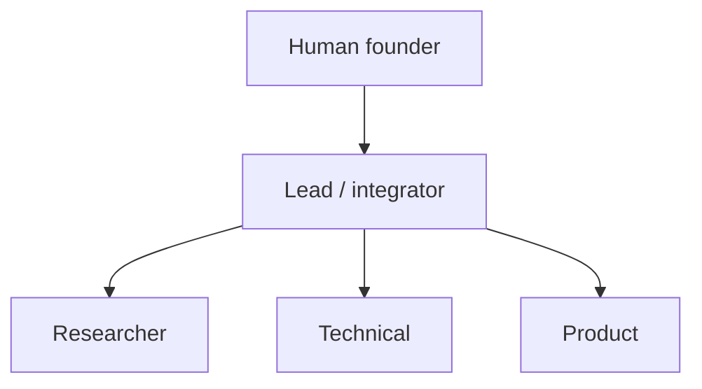

# Org Charter Template

> Purpose: scaffold the basics of your company/org. Copy and replace {{placeholders}}.

## Mission
{{one sentence on why the org exists}}

## Vision
{{describe the future you want to create (see examples/vision-example.md)}}

## Values
1. {{value 1, e.g., goal-driven}}
2. {{value 2, e.g., specialization}}
3. {{value 3, e.g., open communication}}
4. {{value 4, e.g., traceability}}
5. {{value 5, e.g., human in command}}

## Decision mechanism
- Major direction: proposals from roles → cross-review → lead consolidates → human decides.
- Daily matters: delegated to the responsible role.

## Meeting rules
- Every meeting has topic, attendees, conclusions, action items.
- Notes go to {{meetings directory}}, named `YYYY-MM-DD-topic.md`.

---
💡 Minimal viable structure (3 roles + 1 lead)

