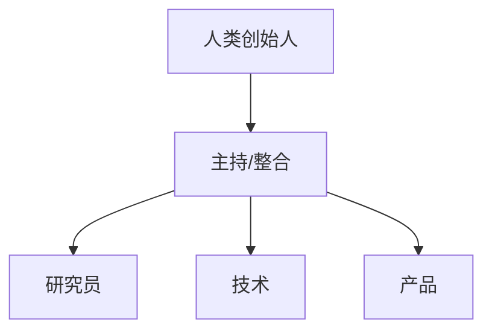

# 公司章程模板（组织骨架）

> 用途：搭建公司/组织的基本盘。复制并替换 {{占位符}}。

## 使命
{{用一句话说明组织存在的理由}}

## 愿景
{{描述希望创造的未来图景（可参考 examples/vision-example.md）}}

## 价值观
1. {{价值观 1，如：目标导向}}
2. {{价值观 2，如：专业分工}}
3. {{价值观 3，如：开放交流}}
4. {{价值观 4，如：可追溯}}
5. {{价值观 5，如：人类指挥}}

## 决策机制
- 重大方向：各角色提案 → 互相评审 → 负责人汇总 → 人类拍板。
- 日常事务：授权对应角色独立执行。

## 会议规范
- 每次会议有主题、参会者、结论、待办。
- 纪要存入 {{meetings 目录}}，命名 `YYYY-MM-DD-主题.md`。

---
💡 建议的组织架构（最小可行：3 角色 + 1 主持）

